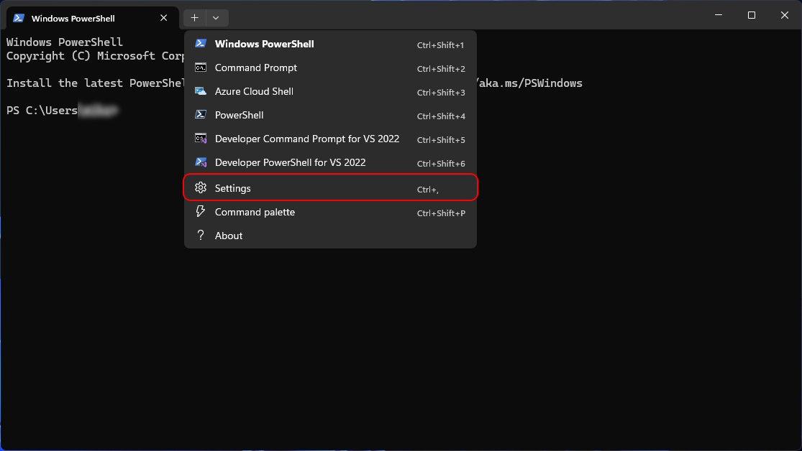
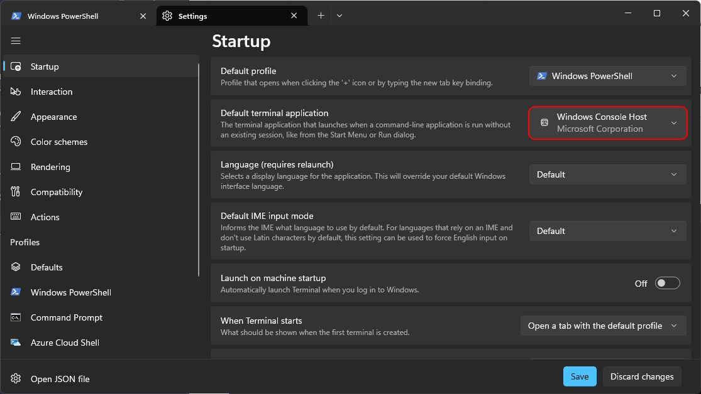
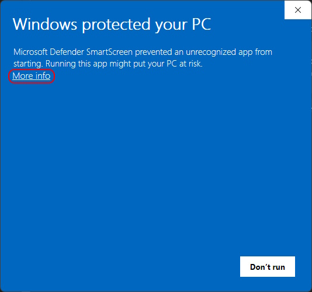
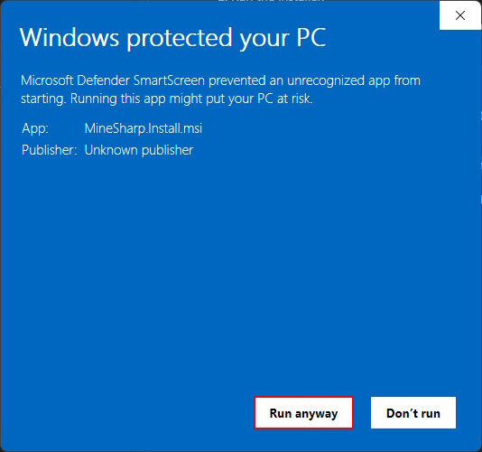

# MineSharp

[Skip to Installation](#installation)

## What does it do?

MineSharp is a simple and quite bad looking Minecraft Launcher, written in C#.\
But there's a twist: everything happens in the console!

Everything works exacty like you would expect a GUI to work, but it's just... in the _Console_!

## System Requirements

### Launcher

|        |       Minimum       |        Recommended        |
| :----- | :-----------------: | :-----------------------: |
| OS     | Windows 7 or higher | Windows 10 22H2 or higher |
| Memory |       128 MiB       |           8 GiB           |

### Minecraft

|                   |                                     Minimum                                     |                                               Recommended                                               |
| :---------------- | :-----------------------------------------------------------------------------: | :-----------------------------------------------------------------------------------------------------: |
| OS                |                Windows 7 and up OR macOS 10.14.5 Mojave and up.                 |                            Windows 10 and up OR macOS 10.14.5 Mojave and up.                            |
| Architecture      |                                  ARM, x64, x86                                  |                                              ARM, x64, x86                                              |
| Memory            |                                      2 GiB                                      |                                                  4 GiB                                                  |
| Motion Controller |                                  Not specified                                  |                                              Not specified                                              |
| Headset           |                                  Not specified                                  |                                              Not specified                                              |
| Processor         | Intel Core i3-3210 3.2 GHz \| AMD A8-7600 APU 3.1 GHz \| Apple M1 or equivalent |            Intel Core i5-4690 3.5 GHz \| AMD A10-7800 APU 3.5 GHz \| Apple M1 or equivalent             |
| Graphics          |                     Intel HD Graphics 4000 \| AMD Radeon R5                     | NVIDIA GeForce 700 series or  AMD Radeon Rx 200 series (excluding integrated chipsets) with OpenGL 4.45 |

## Installation

[Install with Installer (recommended)](#installer) 
[Install manually (portable)](#portable)

### Pre-Install

1. Press the Windows Key to open the Start Menu, type "Terminal" and press enter.

2. Click on the small arrow next to the new tab button and select "Settings".
   

3. Select `Windows Console Host` as the default terminal application.
   

4. You can now close the window.

5. Download `MineSharp.zip` from the [releases tab](https://github.com/immortal640/MineSharp/releases) (expand "Assets").

6. Extract the file to your desired location.

7. Run the `MineSharp.exe`.

> If you don't want to play cracked, select `Sign In` to log in with your microsoft account.

The rest is pretty similar to any other launcher... Just way worse!

### Installer

1. Download `MineSharp.Install.msi` from the [releases tab](https://github.com/immortal640/MineSharp/releases) (expand "Assets").

2. Run the Installer.

3. If you see "Windows protected you PC", you can safely ignore it by clicking `More info`, then `Run anyway`. 
   
   
   > Why does this show up? 
   > To get certified developers usually need to purchase a certificate from a Certificate Authority (CA), which can cost between 100€ and 500€ anually. This is just not feasable for a hobby project.

4. You will be presented with the MineSharp Setup Wizard. Follow the setup wizard's instructions to continue. Now you should have successfully installed MineSharp!
